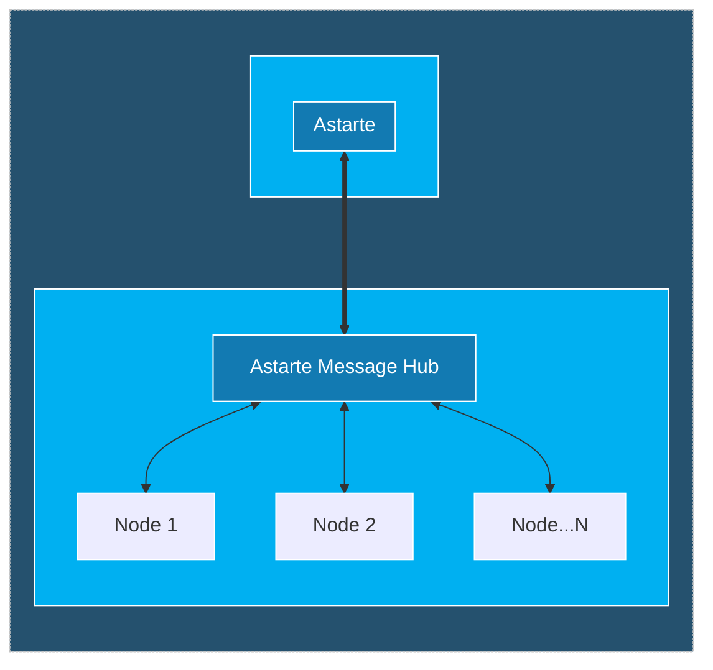
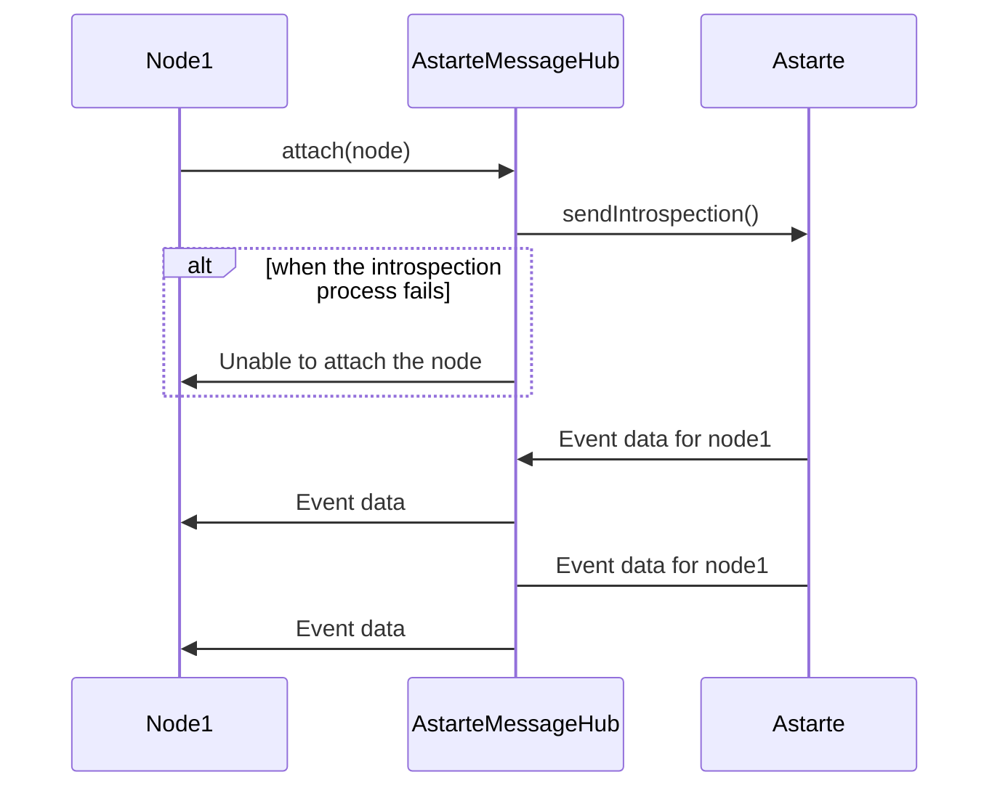

<!---
  Copyright 2022 SECO Mind Srl

  SPDX-License-Identifier: Apache-2.0
-->

# Astarte Message Hub

A central service that runs on (Linux) devices for collecting and delivering messages from N apps using 1 MQTT connection to Astarte.

## Architecture
The Astarte Message Hub is the main component that shares the Astarte connection to the nodes attached to it.
The communication between the Hub and nodes is based on `gRPC` which is great for scenarios like real-time communication, low-power, low-bandwidth systems, and multi-language environments.
`gRPC` makes the most out of `HTTP/2`, with multiplexed streaming and binary protocol framing. In addition, it offers performance advantages through the `Protobuf` message structure and features built-in code generation capability, which enables a multi-language environment.



## GRPC MessageHub Service
### Node
A node is an entity connected to Astarte Message Hub, it can receive/send messages from/to Astarte via the Message Hub.
A node is uniquely identified by its Node UUID and has an Introspection that is a list of Interfaces used by it for exchanging data with Astarte. 

``` protobuf
message Node {
  string uuid = 1;
  repeated Interface introspection = 2;
}
```
### Interface 
[Interfaces](https://docs.astarte-platform.org/snapshot/030-interface.html) are a core concept of Astarte which defines how data is exchanged between Astarte and its peers.

``` protobuf
message Interface {
  string name = 1;
  int32 major = 2;
  int32 minor = 3;
}
```

### Attach Method
When a new node is connected to Message Hub, it will have to call `Attach` method to exchange data with Astarte.
If the node was successfully attached, the method returns a gRPC stream into which the events received from Astarte(based on the declared Introspection) will be redirected.

``` protobuf
service MessageHub {
  rpc Attach(Node) returns (stream NodeMessage) {}
  ....
}
```



