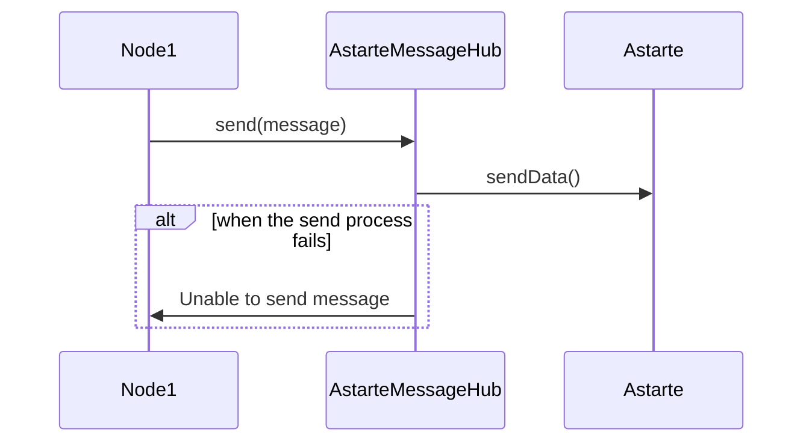
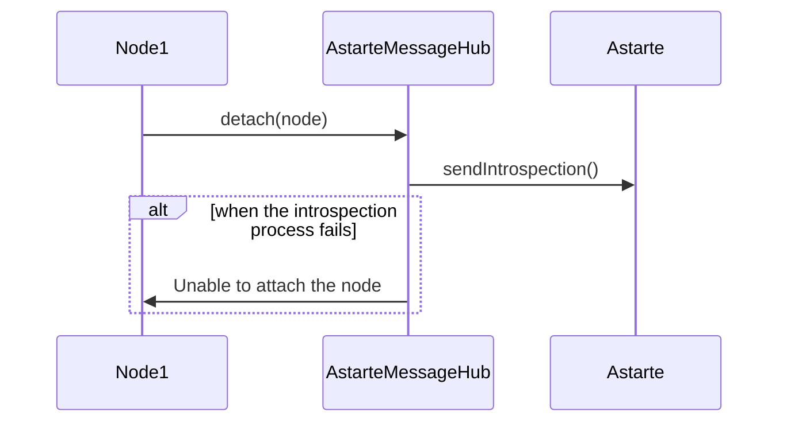

<!---
  Copyright 2022 SECO Mind Srl

  SPDX-License-Identifier: Apache-2.0
-->

# Astarte Message Hub


[](https://app.codecov.io/gh/astarte-message-hub)

A central service that runs on (Linux) devices for collecting and delivering messages from N apps using 1 MQTT connection to Astarte.

## Architecture
The Astarte Message Hub is the main component that shares the Astarte connection to the nodes attached to it.
The communication between the Hub and nodes is based on `gRPC` which is great for scenarios like real-time communication, low-power, low-bandwidth systems, and multi-language environments.
`gRPC` makes the most out of `HTTP/2`, with multiplexed streaming and binary protocol framing. In addition, it offers performance advantages through the `Protobuf` message structure and features built-in code generation capability, which enables a multi-language environment.


## GRPC MessageHub Service
### Node
A node is an entity connected to Astarte Message Hub, it can receive/send messages from/to Astarte via the Message Hub.
A node is uniquely identified by its Node UUID and has an Introspection that is a list of Interfaces used by it for exchanging data with Astarte. 

``` protobuf
message Node {
  string uuid = 1;
  repeated Interface introspection = 2;
}
```
### Interface 
[Interfaces](https://docs.astarte-platform.org/snapshot/030-interface.html) are a core concept of Astarte which defines how data is exchanged between Astarte and its peers.

``` protobuf
message Interface {
  string name = 1;
  int32 major = 2;
  int32 minor = 3;
}
```

### Attach Method
When a new node is connected to Message Hub, it will have to call `Attach` method to exchange data with Astarte.
If the node was successfully attached, the method returns a gRPC stream into which the events received from Astarte(based on the declared Introspection) will be redirected.

``` protobuf
service MessageHub {
  rpc Attach(Node) returns (stream AstarteMessage) {}
  ....
}
```


## Send Method
Send a message to Astarte for a node attached to the Astarte Message Hub.

``` protobuf
service MessageHub {
  rpc Send(AstarteMessage) returns (google.protobuf.Empty){}
  ....
}
```
### Astarte Message

``` protobuf
message AstarteMessage{
  Interface interface = 1;
  string path = 2;
  oneof payload {
    AstarteDataType astarte_data = 3;
    AstarteUnset astarte_unset = 4;
  }
  google.protobuf.Timestamp timestamp = 5;
}

message AstarteUnset{}
```

### Astarte Types
``` protobuf
message AstarteDoubleArray {
  repeated double astarte_double = 1;
}

message AstarteIntegerArray {
  repeated int32 astarte_integer = 1;
}

message AstarteBooleanArray {
  repeated bool astarte_boolean = 1;
}

message AstarteLongIntegerArray {
  repeated int64 astarte_long_integer = 1;
}

message AstarteStringArray {
  repeated string astarte_string = 1;
}

message AstarteBinaryBlobArray {
  repeated bytes astarte_binary_blob = 1;
}

message AstarteDateTimeArray{
  repeated google.protobuf.Timestamp astarte_date_time = 1;
}

message AstarteDataTypeObject {
  map<string, AstarteDataTypeIndividual> object_data = 1;
}

message AstarteDataTypeIndividual {
  oneof individual_data {
    double astarte_double = 1;
    int32 astarte_integer = 2;
    bool astarte_boolean = 3;
    int64 astarte_long_integer = 4;
    string astarte_string = 5;
    bytes astarte_binary_blob = 6;
    google.protobuf.Timestamp astarte_date_time = 7;

    AstarteDoubleArray astarte_double_array = 8;
    AstarteIntegerArray astarte_integer_array = 9;
    AstarteBooleanArray astarte_boolean_array = 10;
    AstarteLongIntegerArray astarte_long_integer_array = 11;
    AstarteStringArray astarte_string_array = 12;
    AstarteBinaryBlobArray astarte_binary_blob_array = 13;
    AstarteDateTimeArray astarte_date_time_array = 14;
  }
}

message AstarteDataType {
  oneof data {
    AstarteDataTypeIndividual astarte_individual = 1;
    AstarteDataTypeObject astarte_object = 2;
  }
}
```


## Detach Method
Remove an existing Node and its introspection from Astarte Message Hub.

``` protobuf
service MessageHub {
  rpc Detach(Node) returns (google.protobuf.Empty){}
  ....
}
```



