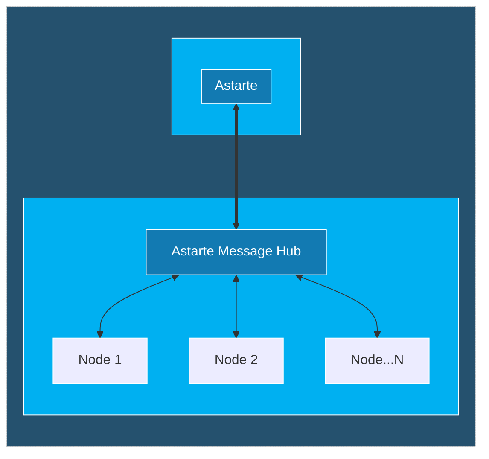
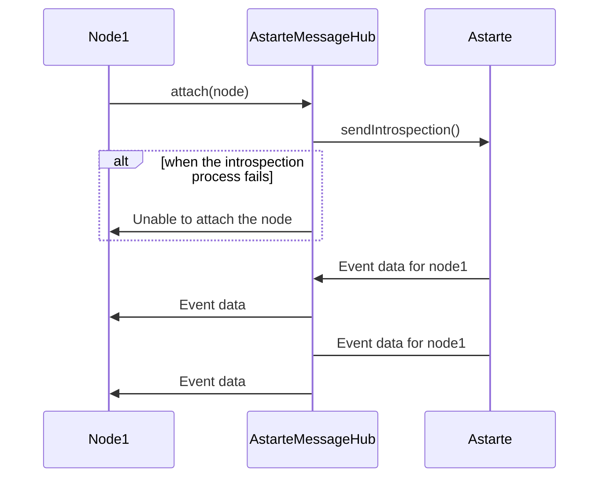
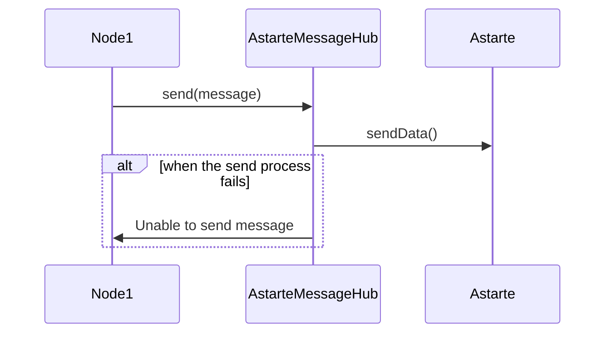
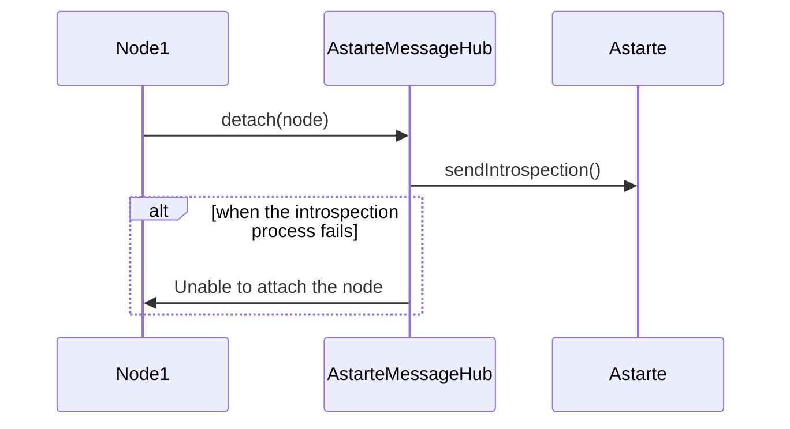

<!--
This file is part of Astarte.

Copyright 2023 SECO Mind Srl

Licensed under the Apache License, Version 2.0 (the "License");
you may not use this file except in compliance with the License.
You may obtain a copy of the License at

  http://www.apache.org/licenses/LICENSE-2.0

Unless required by applicable law or agreed to in writing, software
distributed under the License is distributed on an "AS IS" BASIS,
WITHOUT WARRANTIES OR CONDITIONS OF ANY KIND, either express or implied.
See the License for the specific language governing permissions and
limitations under the License.

SPDX-License-Identifier: Apache-2.0
-->

# Architecture

The Astarte Message Hub is the main component that shares the Astarte connection to the nodes
attached to it. The communication between the Hub and nodes is based on `gRPC` which is great for
scenarios like real-time communication, low-power, low-bandwidth systems, and multi-language
environments. `gRPC` makes the most out of `HTTP/2`, with multiplexed streaming and binary protocol
framing. In addition, it offers performance advantages through the `Protobuf` message structure and
features built-in code generation capability, which enables a multi-language environment.



## GRPC MessageHub Service

### Node

A node is an entity connected to Astarte Message Hub, it can receive/send messages from/to Astarte
via the Message Hub. A node is uniquely identified by its Node UUID and has an Introspection that is
a list of Json Interfaces used by it for exchanging data with Astarte.

```protobuf
message Node {
  string uuid = 1;
  repeated bytes interface_jsons = 2;
}
```

### Attach Method

When a new node is connected to Message Hub, it will have to call `Attach` method to exchange data
with Astarte. If the node was successfully attached, the method returns a gRPC stream into which the
events received from Astarte(based on the declared Introspection) will be redirected.

```protobuf
service MessageHub {
  rpc Attach(Node) returns (stream AstarteMessage) {}
  ....
}
```



## Send Method

Send a message to Astarte for a node attached to the Astarte Message Hub.

```protobuf
service MessageHub {
  rpc Send(AstarteMessage) returns (google.protobuf.Empty){}
  ....
}
```

### Astarte Message

```protobuf
message AstarteMessage{
  string interface_name = 1;
  string path = 2;
  oneof payload {
    AstarteDataType astarte_data = 3;
    AstarteUnset astarte_unset = 4;
  }
  google.protobuf.Timestamp timestamp = 5;
}

message AstarteUnset{}
```

### Astarte Types

```protobuf
message AstarteDoubleArray {
  repeated double astarte_double = 1;
}

message AstarteIntegerArray {
  repeated int32 astarte_integer = 1;
}

message AstarteBooleanArray {
  repeated bool astarte_boolean = 1;
}

message AstarteLongIntegerArray {
  repeated int64 astarte_long_integer = 1;
}

message AstarteStringArray {
  repeated string astarte_string = 1;
}

message AstarteBinaryBlobArray {
  repeated bytes astarte_binary_blob = 1;
}

message AstarteDateTimeArray{
  repeated google.protobuf.Timestamp astarte_date_time = 1;
}

message AstarteDataTypeObject {
  map<string, AstarteDataTypeIndividual> object_data = 1;
}

message AstarteDataTypeIndividual {
  oneof individual_data {
    double astarte_double = 1;
    int32 astarte_integer = 2;
    bool astarte_boolean = 3;
    int64 astarte_long_integer = 4;
    string astarte_string = 5;
    bytes astarte_binary_blob = 6;
    google.protobuf.Timestamp astarte_date_time = 7;

    AstarteDoubleArray astarte_double_array = 8;
    AstarteIntegerArray astarte_integer_array = 9;
    AstarteBooleanArray astarte_boolean_array = 10;
    AstarteLongIntegerArray astarte_long_integer_array = 11;
    AstarteStringArray astarte_string_array = 12;
    AstarteBinaryBlobArray astarte_binary_blob_array = 13;
    AstarteDateTimeArray astarte_date_time_array = 14;
  }
}

message AstarteDataType {
  oneof data {
    AstarteDataTypeIndividual astarte_individual = 1;
    AstarteDataTypeObject astarte_object = 2;
  }
}
```



## Detach Method

Remove an existing Node and its introspection from Astarte Message Hub.

```protobuf
service MessageHub {
  rpc Detach(Node) returns (google.protobuf.Empty){}
  ....
}
```


